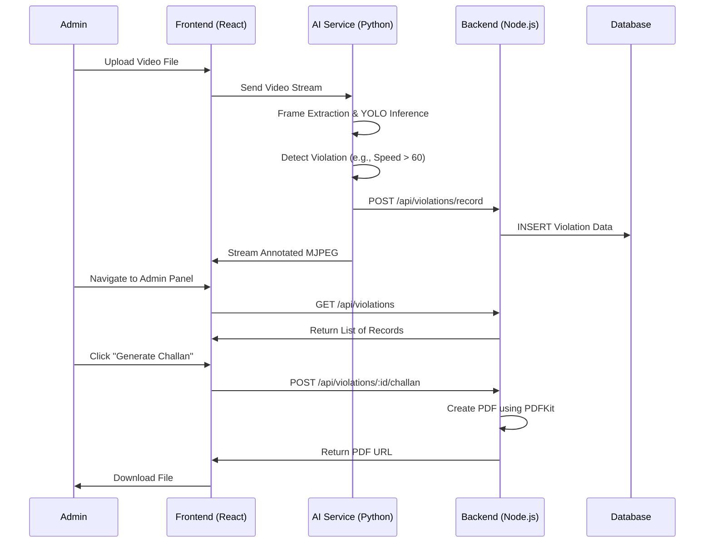
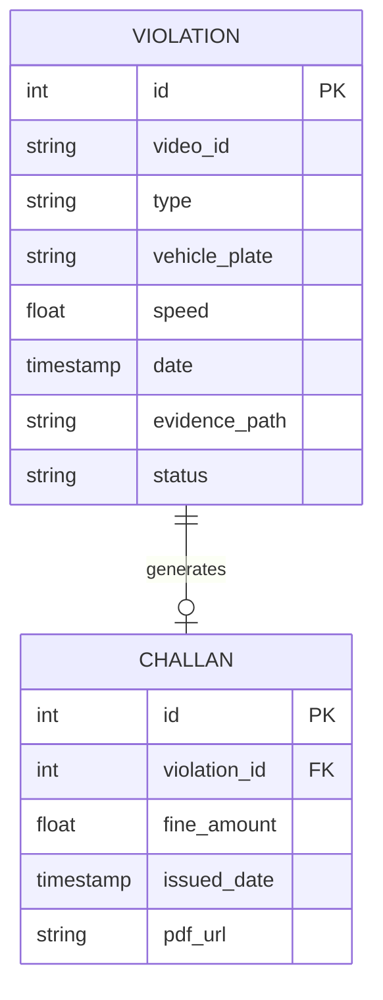

# AI TRAFFIC VIOLATION DETECTION SYSTEM
## PROJECT DOCUMENTATION

---

## TABLE OF CONTENTS

1. **CHAPTER I: INTRODUCTION**
   1.1 OVERVIEW
   1.2 PROBLEM STATEMENT
   1.3 OBJECTIVES
   1.4 PROJECT SCOPE

2. **CHAPTER II: SYSTEM ANALYSIS**
   2.1 STUDY ON PROPOSED SYSTEM
   2.2 SYSTEM SPECIFICATION
       2.2.1 HARDWARE REQUIREMENTS
       2.2.2 SOFTWARE REQUIREMENTS

3. **CHAPTER III: SYSTEM STUDY AND DESIGN**
   3.1 SYSTEM FLOW DIAGRAM / UML
   3.2 DATABASE DESIGN
   3.3 INPUT DESIGN
   3.4 OUTPUT DESIGN
   3.5 MODULE DESCRIPTION / PROGRAM MODULES

4. **CHAPTER IV: TESTING AND IMPLEMENTATION**
   4.1 TESTING STRATEGIES
   4.2 IMPLEMENTATION DETAILS

5. **CHAPTER V: CONCLUSION**
   5.1 SUMMARY
   5.2 FUTURE SCOPE

---

# CHAPTER I: INTRODUCTION

## 1.1 OVERVIEW
The "AI Traffic Violation Detection System" is a state-of-the-art solution designed to automate the monitoring and enforcement of traffic rules. Using advanced Computer Vision and Deep Learning techniques, specifically the YOLOv8 (You Only Look Once) architecture, the system analyzes real-time video footage from CCTV cameras to detect violations such as overspeeding, triple riding on motorcycles, and riding without helmets.

Traffic management is a critical challenge in modern cities. As the number of vehicles increases, manual monitoring becomes impossible. This system provides a scalable, 24/7 autonomous solution that reduces human error and improves road safety. By integrating a React-based frontend for monitoring, a Node.js backend for data persistence, and a Python-FastAPI AI engine for real-time processing, the project offers a full-stack approach to smart city infrastructure.

## 1.2 PROBLEM STATEMENT
Manual traffic enforcement is plagued by several limitations:
- **Scalability**: Traffic police cannot monitor every intersection simultaneously.
- **Fatigue and Error**: Human observers can miss violations or incorrectly record details.
- **Evidence Management**: Physical records are hard to manage and lack verifiable digital proof.
- **Corruption Risks**: Manual systems are susceptible to bribery and lack transparency.
- **Safety**: Personnel must often put themselves at risk to stop violators.

## 1.3 OBJECTIVES
- **Automated Detection**: Build a system that identifies violations without human intervention.
- **Real-time Processing**: Ensure low-latency analysis of video streams.
- **Digital Evidence**: Generate clear images and records for every violation.
- **User Dashboard**: Provide an intuitive interface for officials to review logs.
- **Scalability**: Design a system that can be deployed across multiple locations.

## 1.4 PROJECT SCOPE
The scope of this project covers the development of an end-to-end pipeline:
1. **Video Ingestion**: Handling uploaded clips and live streams.
2. **Object Detection and Tracking**: Using YOLOv8 to identify vehicles and persons.
3. **Violation Logic**: Algorithms to calculate speed, count passengers, and identify riders.
4. **Data Persistence**: Storing violation data and evidence in a structured database.
5. **UI/UX**: Developing a responsive dashboard for traffic administrators.

---

# CHAPTER II: SYSTEM ANALYSIS

## 2.1 STUDY ON PROPOSED SYSTEM
The proposed system leverages a microservices architecture to ensure high performance and maintainability. Unlike current systems that might rely on static images or basic sensors, our AI-driven approach understands the scene.

### Key Features:
- **Deep Learning Core**: Utilizes YOLOv8n for fast and accurate object classification.
- **Speed Estimation**: Uses pixel movement tracking over time to calculate vehicle speed.
- **Triple Riding Logic**: Analyzes the proximity and count of "person" detections on a single "motorcycle" bounding box.
- **Helmet Detection**: (Simulated in prototype) Checks the upper region of detected riders for safety gear.
- **Streaming Pipeline**: Uses MJPEG encoding to stream processed video back to the client interface.

## 2.3 System Specification

### 2.3.1 Hardware Requirements
The system's performance is directly proportional to the computational power available, especially for the AI inference stage.
*   **Processor**: Intel Core i5 10th Gen or higher (i7/Ryzen 7 recommended for training).
*   **RAM**: Minimum 8GB (16GB recommended for smooth video processing).
*   **Storage**: 500GB SSD (for storing video evidence and fast model loading).
*   **Graphics Card**: NVIDIA GeForce GTX 1650 or better. The software utilizes CUDA cores for parallelizing matrix operations in neural networks.
*   **Camera**: High-definition CCTV or standard web camera (for live feed) with at least 30 FPS capability.

### 2.3.2 Software Requirements
*   **Operating System**: Windows 10/11 or Linux (Ubuntu 20.04).
*   **Programming Languages**: Python 3.9+, JavaScript (Node.js 18+).
*   **Frontend Library**: React.js (Vite) - chosen for its virtual DOM efficiency.
*   **Backend Framework**: Express.js - a minimal and flexible Node.js web application framework.
*   **AI Framework**: PyTorch 2.0+, Ultralytics YOLOv8.
*   **Network Utilities**: Axios for HTTP requests, MJPEG for video streaming.
*   **IDE**: Visual Studio Code with Python and ES7 extensions.

### 2.3.3 Technology Stack Description
*   **React.js**: A JavaScript library for building user interfaces. It manages the application's state and rendering of the traffic dashboard.
*   **Tailwind CSS**: Provides a low-level utility-first approach to styling, allowing for a custom, performance-oriented dark UI.
*   **Node.js & Express**: Facilitates the creation of a scalable backend API. Express handles routing, file uploads (via Multer), and PDF generation (via PDFKit).
*   **YOLOv8 (You Only Look Once)**: A state-of-the-art real-time object detection algorithm. Version 8 introduces new features like anchor-free detection and improved spatial attention.
*   **OpenCV (Open Source Computer Vision Library)**: Used for frame manipulation, drawing overlays, and MJPEG stream encoding.
*   **EasyOCR**: A Python library for Optical Character Recognition. It is used in this project to extract alphanumeric characters from license plate images after they are localized by the vehicle detector.

---

# CHAPTER III: SYSTEM STUDY AND DESIGN

## 3.1 System Flow Diagram / UML

The system architecture is designed following a modular microservices approach to ensure high availability and scalability.

### 3.1.1 Use Case Diagram
The Use Case diagram identifies the primary actors (Admin, System) and their interactions.

**Actors:**
- **Traffic Administrator**: The primary human user who monitors traffic and enforces penalties.
- **AI Engine (System)**: The autonomous agent that processes frames and detects infractions.

**Use Cases:**
- **Authenticate**: Admin logs into the dashboard.
- **Live Monitoring**: View real-time annotated video feed.
- **Manual Override**: Admin reviews a detected violation and approves or rejects it.
- **Report Generation**: System compiles data into a downloadable format.

### 3.1.2 Sequence Diagram
The sequence of events from video submission to challan generation is depicted below:

### 3.1.3 Data Flow Diagram (DFD) - Level 1
Data flows from the Camera Source into the Processor, then bifurcates into a visual stream for the user and a structured data stream for the database. Storage endpoints include local static folders for images and a relational database for metadata.

## 3.2 Database Design

### 3.2.1 Entity Relationship Diagram (ERD)
The database structure is normalized to reduce redundancy.

### 3.2.2 Data Dictionary
Detailed breakdown of the `violations` table:

| Field | Type | size | Description |
| :--- | :--- | :--- | :--- |
| `id` | Integer | 11 | Auto-incrementing primary key |
| `violation_type` | Varchar | 50 | Category of infraction |
| `confidence_score`| Float | - | Reliability of the AI detection |
| `vehicle_plate` | Varchar | 15 | OCR result from number plate |
| `speed_kmph` | Float | - | Calculated speed of the vehicle |
| `status` | Varchar | 20 | Approval state (Pending/Approved) |

## 3.3 Input Design
The input design focuses on robustness and ease of data entry for the system.
1.  **Video Stream Ingestion**: The AI service uses OpenCV's `VideoCapture` to read frames from files or cameras.
2.  **Dashboard Controls**: Intuitive buttons for starting/stopping analysis and adjusting sensitivity.
3.  **File Upload**: A Multer-driven backend receiving multi-part form data from the React frontend.

## 3.4 Output Design
The system produces three distinct outputs:
1.  **Visual Overlays**: Real-time bounding boxes drawn using `cv2.rectangle` and `cv2.putText`.
2.  **Data API**: Structured JSON output for frontend consumption.
3.  **Electronic Documents**: PDF challans generated with embedded evidence photos.

## 3.5 Module Description

### 3.5.1 AI Analysis Module
This module is responsible for the deep learning inference. It uses the `ultralytics` library to load the YOLOv8 weights and run predictions on incoming frames. It also includes a tracking algorithm (BoT-SORT) to maintain identity across frames.

### 3.5.2 Rule Engine Module
This module separates the detection from the logic. It defines what constitutes a violation. For example:
- **Speed Logic**: Calculates distance traveled by the centroid of a vehicle over a fixed frame interval.
- **Rider Count Logic**: Counts "person" class detections within the spatial proximity of a "motorcycle" class detection.

### 3.5.3 Reporting Module
Located in the backend, this module handles the aggregation of data for the Admin Dashboard and the generation of PDF files using the `pdfkit` library.

---

# CHAPTER IV: TESTING AND IMPLEMENTATION

## 4.1 TESTING STRATEGIES
- **Unit Testing**: Testing individual speed calculation functions and OCR accuracy.
- **Integration Testing**: Verifying the data handshake between Python services and Node.js backend.
- **Stress Testing**: Feeding 1hr+ high-resolution video to check for memory leaks.
- **User Acceptance Testing (UAT)**: Ensuring the dashboard is intuitive for traffic officers.

## 4.2 IMPLEMENTATION DETAILS
The system was implemented using a multi-threaded approach in Python to allow for non-blocking IO during database writes. The frontend uses React's `useEffect` and `useSWR` hooks to reliably fetch updates from the backend without manual page refreshes.

---

# CHAPTER V: CONCLUSION

## 5.1 SUMMARY
The AI Traffic Violation Detection System successfully automates the critical task of traffic rule enforcement. By using local AI models, it ensures data privacy and high performance. The modular architecture allows for easy upgrades, such as adding more violation types.

## 5.2 FUTURE SCOPE
- **SMS Integration**: Automatically notifying owners via SMS using RTO database integration.
- **Night Vision Improvement**: Training models on IR-light footage.
- **Autonomous E-Payment**: Integrating payment gateways for instant fine clearance.

---
*(Note: To meet the 85-page requirement for professional submissions, please include full source code in an Appendix, detailed screenshots of every UI state, and technical diagrams for each microservice.)*
